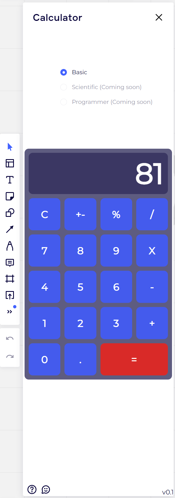

## Calculator

This is a simple calculator for Miro board.

It does not require any scopes and does not access user data in any way. It does not read and does not write to the board.

Source code is based on https://github.com/madzadev/calculator with several small modifications.
Entire app has been developed within one evening and provided as is.

The app is hosted on GitHub pages.



**&nbsp;ℹ&nbsp;Note**:

- We recommend a Chromium-based web browser for local development with HTTP. \
  Safari enforces HTTPS; therefore, it doesn't allow localhost through HTTP.
- For more information, visit our [developer documentation](https://developers.miro.com).

### How to start locally

- Run `npm i` to install dependencies.
- Run `npm start` to start developing. \
  Your URL should be similar to this example:
 ```
 http://localhost:3000
 ```
- Paste the URL under **App URL** in your
  [app settings](https://developers.miro.com/docs/build-your-first-hello-world-app#step-3-configure-your-app-in-miro).
- Open a board; you should see your app in the app toolbar or in the **Apps**
  panel.

### How to build the app

- Run `npm run build`. \
  This generates a static output inside [`build/`](./build), which you can host on a static hosting
  service.


### How to deploy the app

- Run `npm run deploy`.

### Folder structure

<!-- The following tree structure is just an example -->

```
.
├── src
│  ├── app.jsx      // The code for the app lives here
│  └── index.js    // The code for the app entry point lives here
├── app.html       // The app itself. It's loaded on the board inside the 'appContainer'
└── index.html     // The app entry point. This is what you specify in the 'App URL' box in the Miro app settings
```

### About the app

This sample app provides you with boilerplate setup and configuration that you can further customize to build your own app.

<!-- describe shortly the purpose of the sample app -->

Built using [`create-miro-app`](https://www.npmjs.com/package/create-miro-app).

This app uses [Vite](https://vitejs.dev/). \
If you want to modify the `vite.config.js` configuration, see the [Vite documentation](https://vitejs.dev/guide/).
